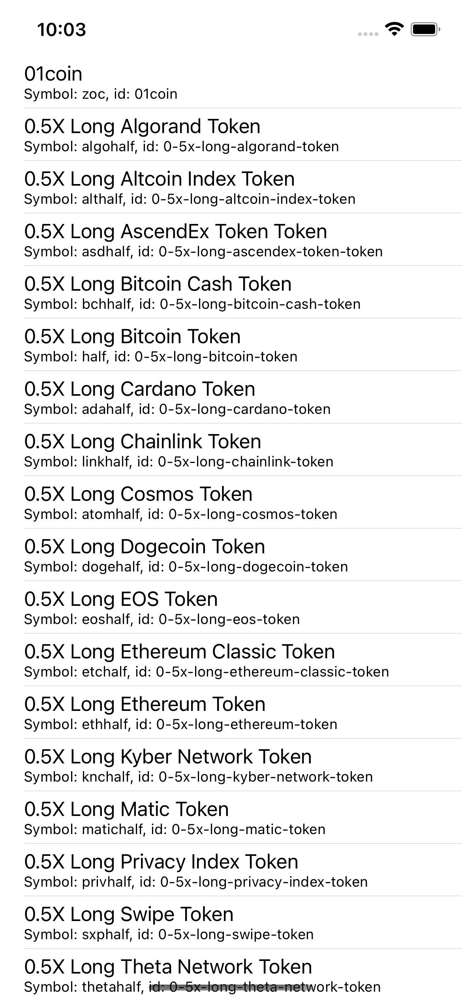

# Moonshot
In this project, you will use your knowledge of Swift and Interface Builder to build an app that allows users to view a price list of ALL Crypto Coins. The UI for this project will be very straightforward. We will be using default cell design to allow more time to focus on accessing the API, Pulling the data, decoding the data, then finally displaying the data to the users.  It's gonna be great!


Students who complete this project independently or as a pairing will showcase their understanding of the following principles:

* Basic Storyboard constraints
* UITableviews
* Creating Custom `class` objects
* Constants, Variables, and Basic Data Types
* Collections
* Functions
* Control Flow
* IBActions && IBOutlets
* API Calls
* API Documentation
---

## Design

Create a `UITableView` with a `subtitle` style and no navigation. Do not forget to create the necessary `Controller` files and to `subclass`




---

## Model
When you are building an app that will display data from an API; that API will determine the properties of your model. Before you ever create the file for your `Model` You need to familiarize yourself with the documentation provided. Spend at least 15 minutes reading the documentation with your partner.  For this app, we will be using the `/coins/list/` endpoint.

You can access the docs for this API here:
[Crypto API Documentation | CoinGecko](https://www.coingecko.com/en/api/documentation)


Not all docs are written equally. The writers of these docs went out of their way to have this API be as user-friendly as possible. They even included a way to test the network calls right from within the docs. Very cool, thank you CoinGecko!

As you are reading the docs you should be looking for a few important pieces of information. THIS REMAINS TRUE FOR ALL API DOCS.

You need to discover the following things:
1. The base URL
	1. What is the *consistent * part of the URL?
2. The full URL
	1. What does the full URL look like?
	2. What `URLComponents` does it need?
	3. What `URL Query Items` does it need?
3. Test the URL in Postman
	1. When you have tested the URL in postman and received a `200` response you can then see what `Properties` and `Values` will be returned to you.

Create a `Model` file with the correct `Properties`.

---


## Model Controller

Create the `Model Controller` file and `class`.

Take a moment and reflect on the purpose of a `Model Controller` and what we need for this project. Typically, a `Model Controller` will house the `CRUD` functions. A ` Source of Truth`, a `Singleton`, if necessary, and other important `Helper` functions. 

Let’s go through each of these one at a time and see how they will work with a `Networking` app.

### CRUD

1. Create
	1. Ask yourself *how* the `Coin` objects will be created. Are they created manually for a user? Or do we fetch the data from an API?
	2. Declare a method signature named `fetchCoins`.
		1. Mark this as a `static` function.
2. Read
	1. Once we have `fetched` the `Coin` objects from the API we will need a location to store them. From this `Source of Truth` the remainder of the application files will *READ* the data.
	2. Declare a local source of truth named `coins`.
		1. Set the type appropriately.
3. Update
	1. Should we allow our users to *change* the data on the  `Coin` objects?
	2. I don’t think so…
4. Delete
	1. Should we allow the users to *remove* `Coin` objects from the `Source of truth`?
	2. I don’t think so… 

### Source of Truth
1. We’ve already created it.

### Singleton
Take a moment and reflect on what a `Singleton` is and when you need one. A Singleton allows you to restrict the initialization of a single class to happen only once. This ensures that the properties, and collections, are always the same set of data. 

When you are pulling the data from an API , every time the data is `fetched` it will replace whatever is in the `Source of Truth`. This ensures the data is already correct without the need for a `Singleton`. If you were to use a `Singleton` for a project like this it would be `Singleton Abuse`.

We will need to access our `Source of Truth` outside this class, however. To allow this please mark your `coins` array as `static`.

### Helper Functions
All we need to accomplish the goals of this app is  `fetch` the data from the API. At this time no additional functions are required. 

---

### Complete the Fetch Function
Within the `fetchCoins` function we have a few goals. 
1. First, we need to decide what we want the `fetch` function to complete with. Because this function will be responsible for hitting an `API Endpoint` we know it will need a completion handler. 
2. Then we need to piece together our URL. 
3. Once we have a `finalURL` we will pass that into the `dataTask(with: _, completion: )` function. This will `complete` with a `response` and either an `error` or `data`. 
4. If we are successful in retrieving data from the `dataTask` we will then need to decode that `data` into our objects. 
5. Once we have our objects we can add them to the `source` of truth.

With our goals laid out let’s start building this piece by piece.

---

#### Completion - Fetch
When deciding what your closures should complete you should consider *how* you want to use the data. Do you want to have a single object available with the task is done? Maybe you want an `array` of objects instead… Would you rather not have any objects, but just a `Bool` that tells you where it worked or not? Each has their merits. 

For this project, we have decided it would be best to complete with a `Bool`. This `success` will complete `true` if everything worked, and `false` if there was an error.

* Modify your `fetchCoins` function to have one parameter named `completion` that is marked as `@escaping` and takes in a `Bool` value and doesn’t `return` anything.

<details>
<summary>How do I write this?</summary>
<br>
static func fetchCoins(completion: @escaping (Bool) -> Void)
<br>	
</details>

Nice work! Let’s move on to the URL

---

#### URL Finalized

Here is what the `finalURL` will look like once it's fully built. 
`https://api.coingecko.com/api/v3/coins/list` 
Reference back to this while building the smaller pieces.

**PAUSE:** You may be asking yourself - “Self, why in the world and I’m breaking apart this URL when I can just use the full URL?” That’s a good question. The reason you are breaking it apart is that it will help you learn the aspects of a URL. You will also learn how to abstract the URL construction, which will, in turn, teach you how to write re-useable network calls. In short - practice makes you proficient. Okay, back to the f***N show.

Here is what the `finalURL` will look like once it's fully built. 
`https://api.coingecko.com/api/v3/coins/list` 
Reference back to this while building the smaller pieces.

* Create a `private` and `static` property `above` the declaration of the `fetchCoins` function. This property will not change and should be named `baseURLString`. 
* Assign the value of the most consistent aspect of the URL

``` swift
private static let baseURLString = "https://api.coingecko.com/api/v3"
```

* Create a `private` and `static` property `above` the declaration of the `fetchCoins` function. This property will not change and should be named `keyCoinsComponent`. 
	* Assign the value of the first `URLComponent` you will need to add to the `baseURLString` to create the `finalURL`.
	* It is the convention to add a `key` to your “constants”. This showcases that they are “keys”, or required building blocks. This is yet another tool to allow you to write the cleanest Swift code possible. 
* Create a `private` and `static` property `above` the declaration of the `fetchCoins` function. This property will not change and should be named `keyListComponent`. 
	* Assign the value of the second `URLComponent` you will need to add to the `baseURLString` to create the `finalURL`.

At this time you should have four properties above your `fetchCoins(completion: Bool)`.
* BaseURL
* Coin Component
* List Component
* coins

Now, let’s navigate to inside the body of the `fetchCoins(completion: Bool)`. To create your `finalURL` we will need to perform the following tasks:

* guard that you can initialize a new URL  named `baseURL`from the `baseURLSTring`
	* else { return completion(false) }
	* We want to complete `false` if this step fails
* create a new constant named `coinsURL` by appending the `keyCoinsComponent` to the `baseURL`
* create a new constant named `finalURL` by appending the `keyListComponent` to the `coinsURL`
* print the `finalURL`

Build and run. Commit, and take a 15 min break! We are now 1/3 of the way complete with our `fetchCoins(completion: Bool)`.

---

#### DataTasking

Under the creation of the `finalURL` we will perform a `dataTask` that will  `complete` with a `response` and either an `error` or `data`. If we are successful in retrieving data from the `dataTask` we will then need to decode that `data` into our objects. Once we have our objects we can add them to the `source` of truth. To accomplish this we need to:

* call the `dataTask(with: URL, completionHandler: (Data?, URLResponse?, Error?) -> Void)` from the `shared` singleton on the `URLSession` class.
	* pass in the `finalURL`.
	* press `enter` on the autocompleteable aspect of the closure.
		* ( I made that name up, ¯\_(ツ)_/¯ )
	* Immediately head to the closing brace of this method and call `.resume()`.
		* The program will not run without this line
	* name each item
		* coinData
		* _
		* error
	* conditionally unwrap an `error`
		* If `true` 
			* print `”There was an error: \(error.localizedDescription)”`
			* completion(false)
	* We are going to ignore the `response`
	* guard you can create `data` from `coinData`
		* else 
			* completion(false)
			* return
	
Okay, this next section will be the most challenging aspect of your Paired Programming Project.
* Declare a Do -> Try -> Catch block.
* Within the body of the `do`:
	* `if let` a new constant named `topLevelArrayOfCoinDictionaries`
		* I know that’s a long name but I want it to be readable for what the constant technically is…
	* assign the value of `try` ing to create a `JSONObject` with the `data` you unwrapped above. This should allow some fragments, and be `optionally Type Cast` as an Array of Dictionaries that hold String keys and String values.
		* `[[String:String]]`
Within the `true` body of the `if let` you just created we need to loop through the `topLevelArrayOfCoinDictionaries` and interact with each dictionary one at a time.
* for `coinDictionary` in `topLevelArrayOfCoinDictionaries`:
	* `if let` you can create a constant named `id` and assign the value of `coinDictionary`subscrtiped with the key `”id”`.
	* continuing with the same `if` create a new constant named `symbol` and assign the value of  `coinDictionary`subscrtiped with the key `”symbol”`.
	* continuing with the same `if` create a new constant named `name` and assign the value of  `coinDictionary`subscrtiped with the key `”name”`.
Within the true of this `if let`:
*  Create a new constant named `parcedCoin` and assign the value of a `Coin` initialized with the property’s we just subscripted from the `coinDictionary`.
* append this to the `source of truth`.
* above the closing brace of the `do` call you successful completion. 
	* completion(true)
Within the body of the `catch`:
*  print `”Error in Do/Try/Catch: \(error.localizedDescription)”`.
* call the completion as a failure.

Take a well-deserved sigh of relief. We did it! We have completed the networking code required to hit the `API Endpoint` and parse the data to create our `Coin` objects! Well done.

* A - Always
* B - Be
* C - Committing

Build. Run. Commit. Party

---

## Wire Up the views
To complete our app and test the networking we need to wire up the `UITableViewController` you created earlier. The first thing we need to do is call our `fetchCoins` function. If it completes successfully we will want to reload the `tableView`. Then, we need to complete the `UITableViewDataSourceMethods`. Let’s get coding!

Within the body of the `viewDidLoad` write the following code:
* call the `fetchCoins` function from the `CoinController`.
* press `enter` on the `autocompleteable` aspect of the closure.
	* ( I made that name up ¯\_(ツ)_/¯ )
* replace the `Bool` with the word `success`.
* replace the `code` with a check if success is `true`.
	* if `true` write the following code.
```swift
DispatchQueue.main.async {
   self.tableView.reloadData()
 }	
```

Great work! Now, complete the `UITableView` Data Source methods.
* Number of Rows
* Cell for row

Build and run your app! Everything should work. Hunt down and eradicate any bugs that may be present. Great work!

Commit the final project and submit.


